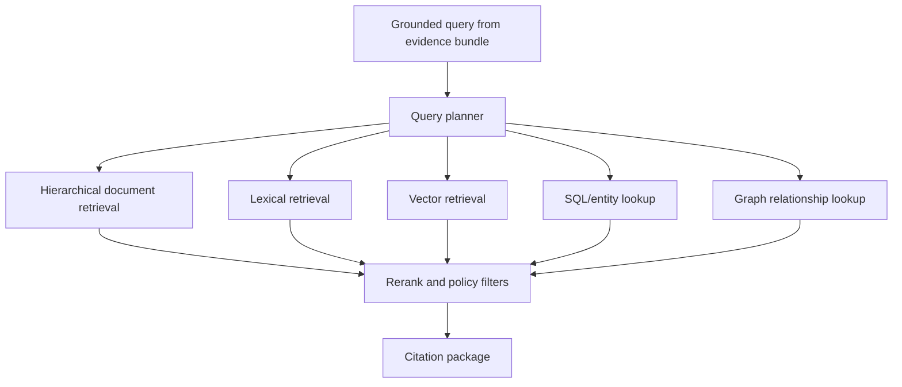

# RAG Architecture

**Status:** Phase 0 design contract
**Role:** retrieve and cite context; never determine the sanctions-review route

## 1. Objective

The retrieval-augmented generation subsystem provides analysts and downstream note generation with relevant, attributable context from policy, guidance, list evidence, and prior cases.

RAG is deliberately separated from deterministic matching and policy. A retrieval failure, irrelevant passage, or malicious document must not alter the platform's authoritative decision.

## 2. Retrieval use cases

- explain why a specific ISO 20022 field is or is not eligible for a screening route;
- retrieve the policy rule supporting a blocker or required next step;
- locate guidance relevant to a list source, entity type, identifier, jurisdiction, or message type;
- find similar historical false-positive fixtures or adjudicated cases;
- retrieve evidence about a candidate profile or relationship; and
- provide cited context for an analyst-note draft.

## 3. Source classes

### Tier A — authoritative external material

Examples include official list documentation, regulator guidance, standards documentation, and formally published industry guidance.

### Tier B — institution-controlled policy

Approved policies, procedures, risk assessments, screening plans, model documentation, and control standards. Effective date, owner, approval status, and supersession must be recorded.

### Tier C — adjudicated cases and validated fixtures

Historical decisions, analyst rationales, regression cases, and approved false-positive typologies. Access is tenant-scoped and sensitive data must be protected.

### Tier D — exploratory material

Research notes, synthetic examples, draft policies, and unapproved documents. These sources may support research but must be clearly labeled and excluded from authoritative citation modes unless explicitly requested.

## 4. Hybrid retrieval design

No single index is sufficient for all evidence types.



### Hierarchical/document-structure retrieval

Use for long policies and guidance where section, table, appendix, page, footnote, and effective-date context matter.

### Lexical retrieval

Use for exact rule IDs, list names, message paths, identifiers, acronyms, program names, and reason codes.

### Vector retrieval

Use for semantically similar prior cases, noisy analyst narratives, and paraphrased false-positive descriptions.

### SQL/entity retrieval

Use for canonical list profiles, aliases, identifiers, programs, addresses, and immutable source assertions.

### Graph retrieval

Use for ownership, control, membership, vessel relationships, corporate hierarchies, and linked source records when graph evidence is available.

## 5. Ingestion pipeline

```text
acquire source
verify source and rights
record source metadata and checksum
extract text and structure
classify source tier and access scope
split by document hierarchy
create lexical/vector representations where permitted
validate locators and citations
publish immutable corpus snapshot
```

Required metadata includes:

```text
source_id
source_uri or internal reference
document_title
publisher/owner
jurisdiction
document_type
source_tier
publication_date
effective_from/effective_to
approval_status
supersedes/superseded_by
section/page/table locator
content_checksum
corpus_snapshot_id
tenant/access scope
```

## 6. Chunking rules

- Preserve headings and ancestor hierarchy.
- Do not split a table from its title, header, or explanatory note.
- Preserve page/section locators even when text is reflowed.
- Keep definitions with their defined terms.
- Avoid mixing superseded and current policy in one chunk.
- Keep case facts separate from analyst conclusions and final disposition.
- Redact or tokenize sensitive data before embedding when policy requires it.
- Record extraction warnings and do not silently invent missing text.

## 7. Grounded query contract

Retrieval receives structured facts, not an unrestricted user prompt alone:

```json
{
  "task": "explain_policy_route",
  "tenant_id": "tenant-a",
  "decision_route": "investigate",
  "reason_codes": ["entity_type_conflict"],
  "message_type": "pacs.008",
  "semantic_role": "creditor.name",
  "candidate_entity_type": "vessel",
  "policy_version": "transaction-screening-r1",
  "effective_at": "2026-07-13T00:00:00Z"
}
```

The query planner converts this contract into source-specific queries and metadata filters.

## 8. Retrieval policy

Retrieval must enforce:

- tenant and access boundaries;
- allowed source tiers for the task;
- effective-date and supersession rules;
- jurisdiction and business-line filters;
- policy-version pinning where applicable;
- maximum result counts and context budgets; and
- minimum provenance completeness.

A highly similar but superseded policy must not outrank the effective approved policy merely because its wording is closer.

## 9. Citation package

Every passage exposed to an analyst or LLM contains:

```text
citation_id
source_id
source tier
title and publisher
version/effective date
section/page/table locator
verbatim excerpt or structured fact
content checksum
retrieval method and score
corpus snapshot
access scope
```

The final note cites `citation_id` values. A post-generation validator verifies that cited IDs exist and that material claims are supported by the cited content.

## 10. Prompt-injection and hostile-content controls

Retrieved content is data, not authority over system behavior.

- Strip or neutralize executable markup where appropriate.
- Mark document text with explicit boundaries and source metadata.
- Do not allow retrieved instructions to change tools, policies, system prompts, schemas, or access scope.
- Reject requests to reveal secrets or cross-tenant content.
- Prefer extractive facts and short cited passages over unrestricted document dumps.
- Log suspected instruction-like content for evaluation.

## 11. Prior-case retrieval controls

Historical cases are useful but high risk. The system must:

- distinguish final adjudication from interim analyst opinion;
- record the policy and list version active at the time;
- avoid treating case frequency as policy authority;
- exclude appealed, corrected, or low-quality cases when configured;
- redact personal or account information according to deployment policy; and
- explain important differences between the current case and retrieved examples.

## 12. RAG and LLM boundary

RAG may produce a citation package without calling an LLM. When an LLM is used, it receives:

- the deterministic decision and trace as immutable facts;
- a bounded evidence bundle;
- an allowlisted citation package; and
- a strict output schema.

It does not receive credentials, unrestricted database access, or authority to call the policy engine with modified facts.

## 13. Evaluation

Evaluate retrieval separately from generated prose.

### Retrieval metrics

- authoritative-source recall;
- locator and citation validity;
- effective-policy precision;
- tenant/access leakage rate;
- superseded-document error rate;
- prior-case relevance and difference coverage;
- latency and context size.

### End-to-end assertions

- required policy citations are present;
- prohibited sources are absent;
- every material generated claim is supported;
- retrieval failure does not alter the deterministic route; and
- replay with a pinned corpus snapshot is reproducible.

## 14. Initial implementation direction

The architecture permits local components such as:

- PostgreSQL for corpus metadata and canonical records;
- object storage for original documents and extracted artifacts;
- Qdrant or another replaceable vector index;
- optional Neo4j or another graph implementation; and
- a Go retrieval service or module shared by API, worker, and evaluation commands.

These are implementation choices behind interfaces, not permanent public contracts.

## 15. Phase 6 acceptance criteria

- ingest authoritative and institution-policy documents into immutable snapshots;
- retrieve effective policy by structured metadata and semantic context;
- retrieve similar validated fixtures or cases without cross-tenant leakage;
- return resolvable citations with source and location metadata;
- detect missing, superseded, and unapproved source conditions;
- generate a note only from allowlisted evidence and citations; and
- replay the same query against a pinned snapshot.

## 16. Phase 6A implemented baseline

Phase 6A implements the first in-repository contracts described above:

- checksum-protected corpus manifests and immutable hierarchical snapshots;
- structured decision-to-query adaptation;
- tenant, approval, effective-date, tier, and prompt-injection filters;
- deterministic metadata, lexical, and hashed-vector scoring;
- resolvable claim-ready citation packages; and
- byte-stable replay goldens.

The hashed-vector baseline is intentionally replaceable by Qdrant or another vector backend. Replacement adapters must preserve snapshot pinning, filters, citation locators, and deterministic decision independence.
